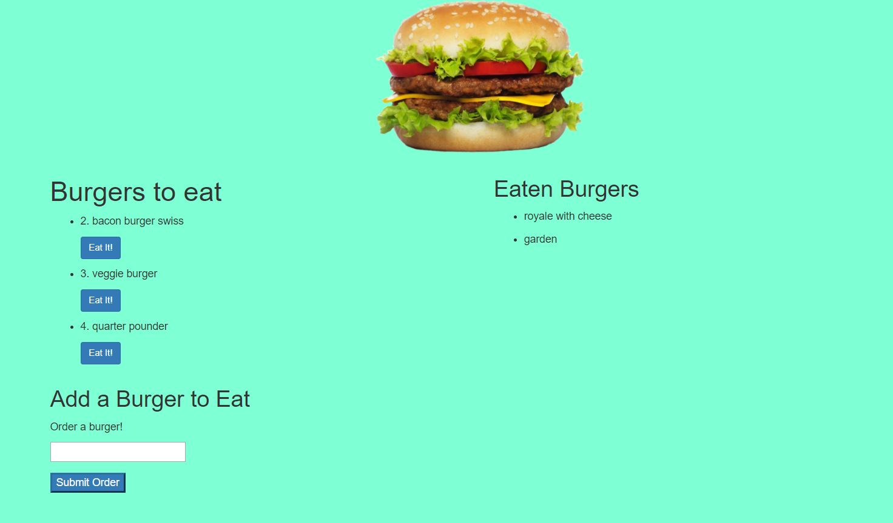
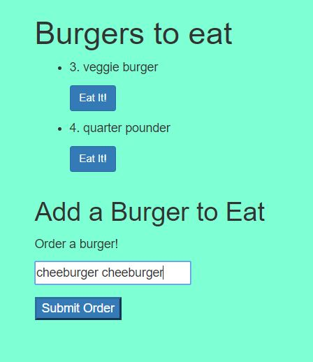
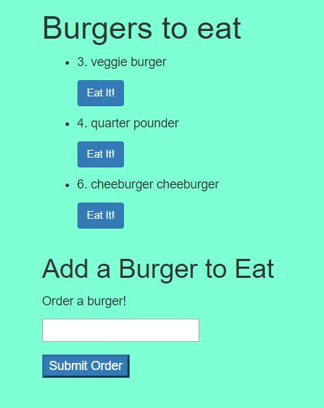
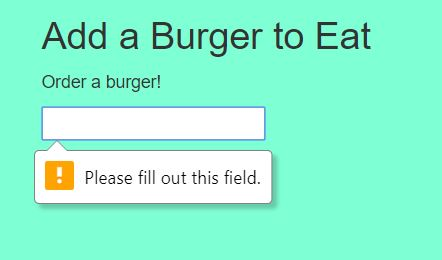

<h1>Burger Time!</h1>

This app will synce up a MySQL database with a fully functioning node-express-handlebars app. The app will ask the user to order a hamburger. That hamburger will be added to the Burgers section. The user can then choose to "eat" any of the burgers and thus move them over to the "eaten" cateogory.

